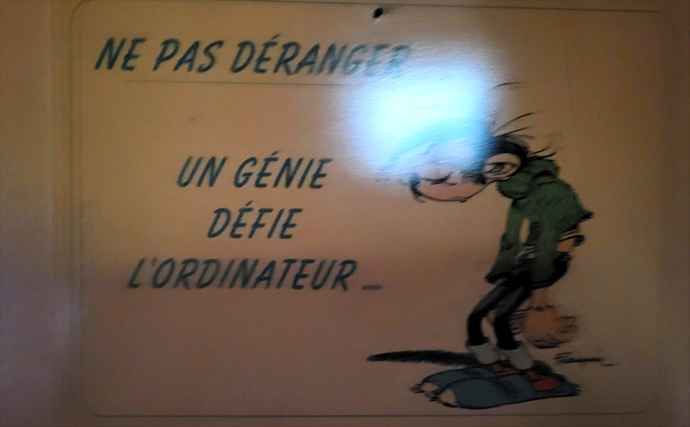

# Pierre-Yves PARANTHOEN
### `F5TMZ` · `NuxSFM` — Old school. No bloat. No GUI. Just the terminal.

Dev & utilisateur Linux depuis le **kernel 0.01 (1991)**. *Linux from scratch*, littéralement.
Opérateur radio-amateur, pionnier de la première webcam TCP/IP sur VHF à 1200 bauds.
Le savoir veut être libre — le terminal aussi.

## Philosophie

```c
while (memory_available) {
    eat_major_portion_of_memory(no_real_reason);
    if (feel_like_it)
        make_user_THINK(this_is_an_OS);
    gates_bank_balance++;
}

while (memory_microsofted) {
    system_response;
    cout << blow_this_OS_away;
    cout << install_linux++;
}
```

---

## Stack

```
$ uname -a && echo "No GUI! Never!"
Languages  : BASIC · Assembleur · MS-DOS batch · COBOL (MERISE) · C · C++ · Unix Shells · XML · Python
Editor     : VIM
Shell      : Bash
Interface  : TTY or nothing
```

## Projects & Contributions

- **[NuxSFM](https://sourceforge.net/projects/nuxsfm/)** — Custom Linux Creation
- **[Linux From Scratch](https://www.linuxfromscratch.org/)** — Contributor & developer
- **[MythTV](https://www.mythtv.org/)** / **[VDR](https://www.tvdr.de/)** — Contributor & developer
- **[OpenMVG](https://github.com/openMVG/openMVG)** — Early tester & feedback contributor
- **[JNOS](https://www.langelaar.net/jnos2/) / [TNOS](https://www.tnos.net/)** — KA9Q-derived TCP/IP packet radio stacks, ham operator & tinkerer
- **First TCP/IP Webcam over VHF at 1200 bauds** — Radio-amateur pioneer

## Interests

| Domain | Languages |
|--------|-----------|
| Linux Kernels | C++ · Python |
| Operating Systems | C++ · Python |
| 3D Rendering | C++ · Python |

---

## Au-delà du code

**Radio-amateur** — `F5TMZ`. Packet radio, TCP/IP qui voyage par les ondes
quand personne ne pensait que c'était possible. Le réseau avant le réseau.

**Les langues** *(la version humaine)*
- **Courant** (parlé & écrit) : Français · English · Español
- **Lecture / partiel** : Brezhoneg (Breton) · Italiano
- **Natif** : `0` et `1`

**Philosophie** — pourquoi je fais ça depuis si longtemps :

```c
while (memory_available) {
    eat_major_portion_of_memory(no_real_reason);
    if (feel_like_it)
        make_user_THINK(this_is_an_OS);
    gates_bank_balance++;
}
while (memory_microsofted) {
    system_response;
    cout << blow_this_OS_away;
    cout << install_linux++;
}
```

---

## Origin

> Tout a commencé à 11 ans, devant un écran où clignotait un curseur.
> Pas de mode d'emploi, pas de garde-fou — juste l'envie de comprendre
> ce qu'il y avait derrière, et de le faire plier à ma volonté.
>
> Je n'en ai jamais fait mon métier. J'en ai fait mieux : un terrain de jeu
> qui n'a jamais fermé. Le curseur clignote encore.

<p align="center">
  <br>
  <sub><i>Sur la porte de mon shack depuis 35 ans.</i></sub>
</p>

---

`F5TMZ` · Old school · No bloat · No GUI · Just the terminal · *Knowledge wants to be free — and so does the terminal.*
